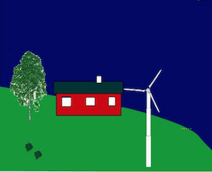

# Grønn energi - Eksamen V17

## Om oppgaven

Denne oppgaven er hentet fra eksamen i IT2 V17. Den er godt egnet for å trene på animasjoner

Det har blitt stadig mer populært med fornybare energikilder til bruk i private hjem og
fritidseiendommer. Mange ønsker f.eks. å finne ut hvor mye energi de kan produsere
med ulike former for fornybare energikilder, eller se på hvordan fornybare energikilder
virker/fungerer.

## Oppgave 1: Vindmølle- og væranimasjon

Du skal lage en applikasjon som viser en vindmølle plassert i et landskap. I applikasjonen
skal bladene på vindmølla kunne roteres, og det skal være elementer i landskapet som
skal animeres når vindstyrken endres.

I applikasjonen skal brukeren kunne oppgi betegnelsen på en vindstyrke, og applikasjonen skal kunne vise virkningene i landskapet for den vindstyrken. Du finner en oversikt i vedlegget over ulike vindstyrker og beskrivelser av virkninger av vinden i landskapet. På eksamen er det nok at du lager animasjoner for vindstyrkene stille, lett bris og stiv kuling. Bladene på vindmølla skal ha ulik fart i de tre tilfellene, og når en vindstyrke er valgt, skal den også vises på skjermen («0–0.2 m/s», «3.4–5.4 m/s» eller «13.9–17.1 m/s»). Lyden av vind skal spilles når lett bris eller stiv kuling blir valgt. En fil med vindlyd ligger vedlagt. Det skal være mulig å kjøre animasjonene flere ganger og i den rekkefølgen brukeren ønsker. Du kan tegne eller lage et bilde ved å kombinere elementer fra vedlagte foto/skisser, f.eks. lik tegningen under. Du kan også utforme bildet helt annerledes om du ønsker det.

## Oppgave 2. Wattproduksjon per time

Tabellen under viser hvor mange watt vindmølla produserer i timen ved forskjellige
vindstyrker (omtrentlige verdier).

|  Navn  |  m/s  | Watt per time |
|:------:|:-----:|:-------------:|
| Stille       |0 - 0.2  | 0|
| Flau vind    |0.3–1.5  | 0|
| Svak vind    |1.6–3.3  | 2|
| Lett bris    |3.4–5.4  | 10|
| Laber bris   |5.5–7.9  | 60|
| Frisk bris   |8–10.7   | 150|
| Liten kuling |10.8–13.8| 400|
| Stiv kuling  |13.9–17.1| 500|
| Sterk kuling |17.2–20.7| 0|
| Liten storm  |20.8–24.4| 0|
| Full storm   |24.5–28.4| 0|
| Sterk storm  |28.5–32.6| 0|
| Orkan        |32.7-    | 0|

(Vindmølla starter først å gå ved 2.5 m/s, og den stopper av sikkerhetsgrunner når
vinden blir sterkere enn 15 m/s.)

Brukeren skal kunne oppgi vindstyrke i m/s, og applikasjonen skal så vise hvor mange
watt som produseres i timen. Eksempel: Dersom brukeren oppgir 3.7 m/s, skal det
skrives ut at vindmølla gir cirka 10 watt i timen.

## Oppgave 3: Wattproduksjon per døgn

En oversikt fra yr.no over neste døgns vindstyrker kan se slik ut, oppgitt i 6-
timersperioder:

Lag en rutine der brukeren kan registrere inn vindstyrkene i de fire 6-timersperiodene.
Applikasjonen skal så beregne hvor mange watt vindmølla produserer det døgnet med de
oppgitte vindstyrkene. Applikasjonen skal bruke tabellen i oppgave 2 som grunnlag for
utregningen.

### Oppgave 3a: Dokumentasjon

Skriv en grov pseudokode for oppgave 3.

### Oppgave 3b

Programmer rutinen, og dokumenter koden.

---

_Denne oppgaven er opprinnelig publiser på_ [UDIR](https://dok.udir.no/EksamensOppgaver.aspx?proveType=EV) og tilpasset og omskrevet til undervisning av [fuzzbin](https://github.com/fuzzbin). Oppgaven er lisensiert som ?
